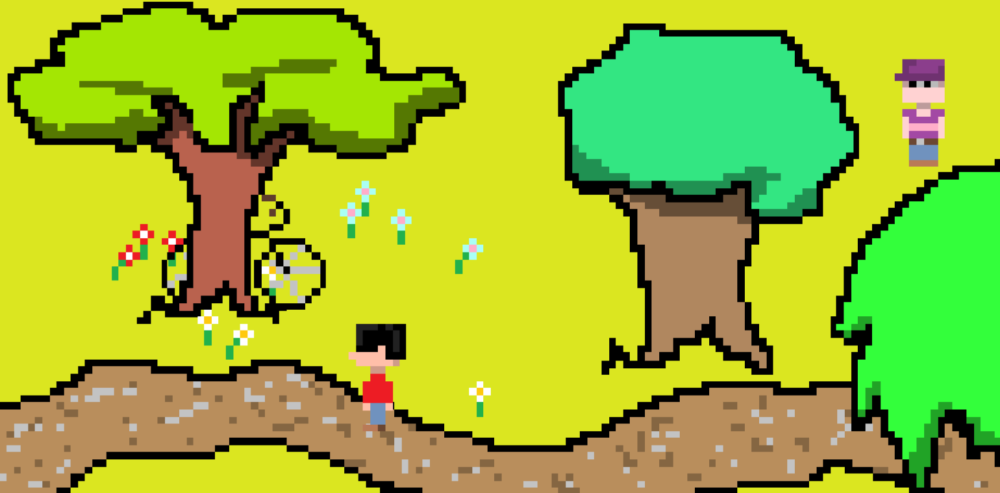

Description:
Le Reflet de l'Autre est un jeu 2D inspiré de Stardew Valley et d'Omori dans le style graphique et dans la narration. C'est un projet qui me tient à coeur, ce qui a été une source de motivation mais aussi un obstacle, car le projet se veut ambitieux et je n'ai pas eu le temps de créer une histoire complète comme je l'aurais souhaité. Je considère donc que cette version est une démo du jeu que je terminerai plus tard pour moi-même et mes proches. On peut dialoguer avec quatre pnj, jouer au foot et récupérer des objets.

Screenshot:

Comment lancer le jeu:
Le jeu est jouable sur Itch.io dans le navigateur, à cette adresse : https://timolol78.itch.io/le-reflet-de-lautre-dmo

Prérequis du jeu:
Le jeu ne nécessite pas de module, de librairie ou de script intégré pour fonctionner, il suffit d'un navigateur internet.

Crédits:
J'ai créé tous les assets et tous les sons du jeu. J'ai emprunté la police d'écriture à DaFont.com : https://www.dafont.com/fr/oldnewspapertypes.font

Utilisation de LLM:
J'ai utilisé ChatGPT occasionellement pour corriger des bugs ou m'aider à créer des petites fonctionnalités comme la gestion de l'inventaire ou le comportement de l'adversaire au foot avec des prompts tel que : "salut, ca fait crasher quand j'écris ça sur kaplay musique_jeu.play({volume: 0.7})" ou encore "salut chat, je code sur kaplay et j'ai créé des objets arbres en 2d. j'aimerais que lorsque mon jour marche devant l'arbre, il passe devant celui ci, et s'il passe derrière l'arbre il soit caché derrière l'arbre. Comment faire ?"

Contexte de création:
Ce projet a été développé dans le cadre du cours "Jeux Vidéo 2D - P2026" dispensé par Loïc Cattani (SLI, Lettres, UNIL)
